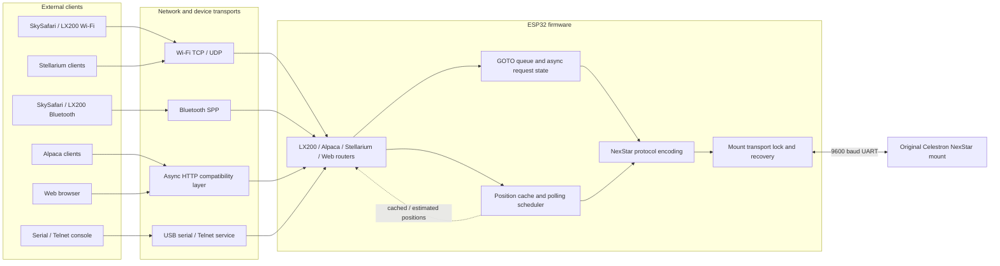
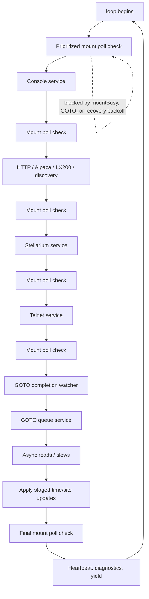
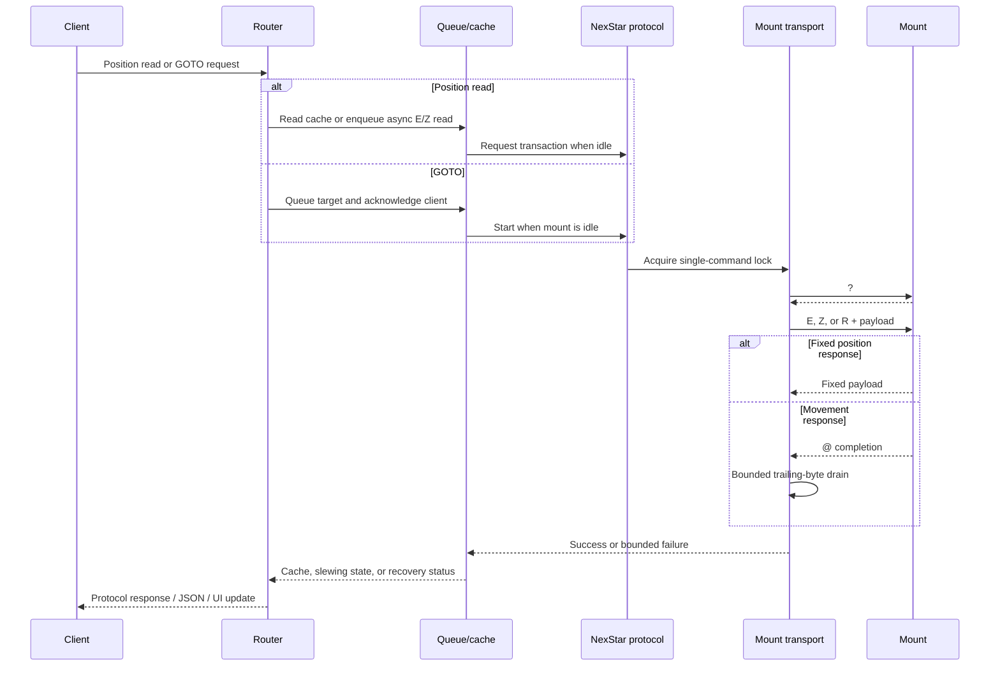
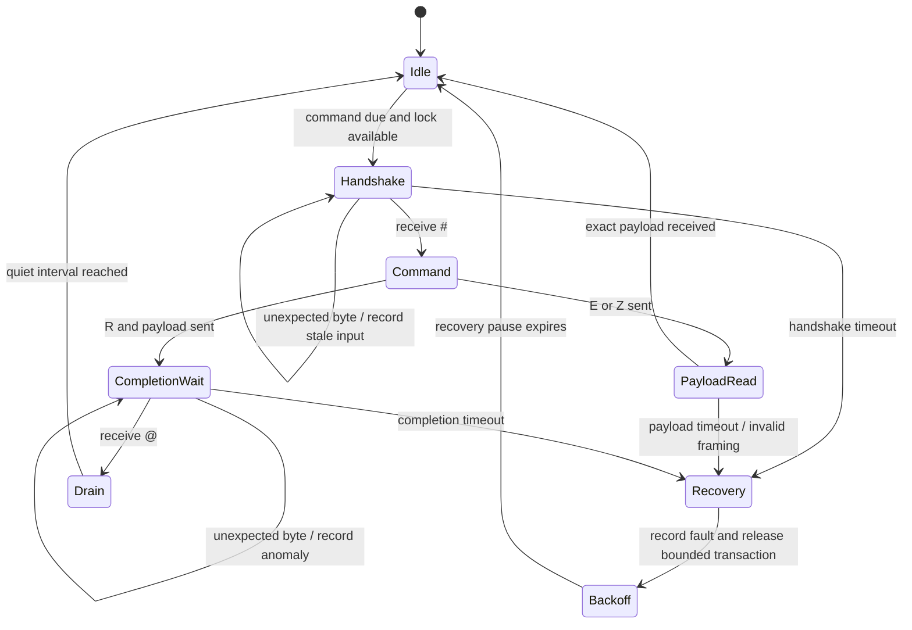

# Functional and block diagrams

These diagrams describe the modular v1.0.0 architecture. They are logical
diagrams: module ownership is more stable than individual function names, and
some application state still resides in the Arduino sketch during the
modularization work.

## Overall system block diagram

## Main loop and service ordering

## Client request path

## Mount transaction and recovery state machine

The state machine is the contract for future refactors: no new mount command
may bypass the lock, and normal E/Z polling must not restart before a GOTO
completion and drain boundary is complete.
